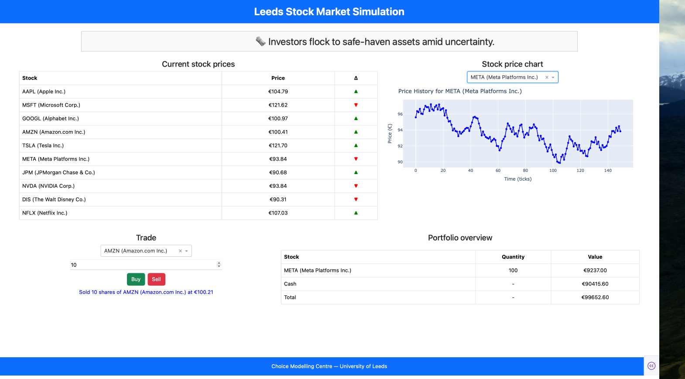
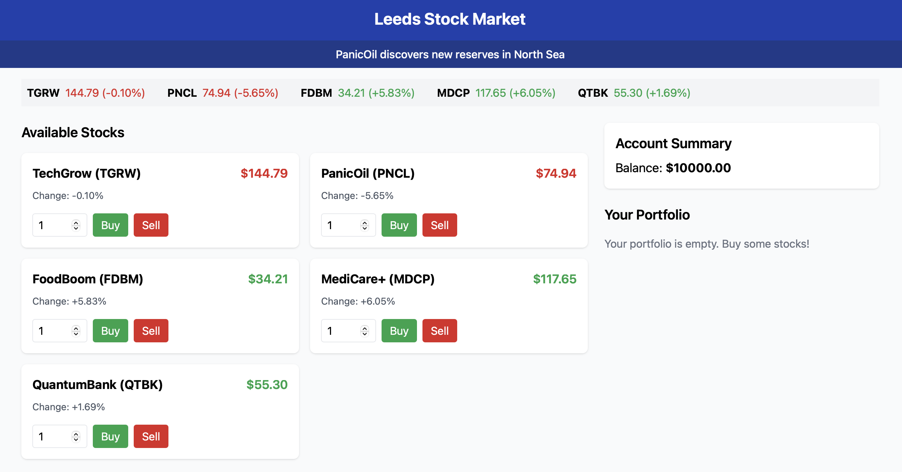

# Leeds Stock Market (Dashapp)

An interactive stock market simulator built with **Dash** and **Sqlite**. Users can buy and sell virtual stocks, monitor real-time price changes, and view dynamic market news. All actions are tracked and stored in the respective datasets as well as stock prices.




# Leeds Stock Market (Js)

A minimal and interactive stock market simulator built with **React** and **Tailwind CSS**. Users can buy and sell virtual stocks, monitor real-time price changes, and view dynamic market news.



## Getting Started

```bash
git clone https://github.com/your-username/leeds-stock-market.git
cd leeds-stock-market
npm install
npm start
